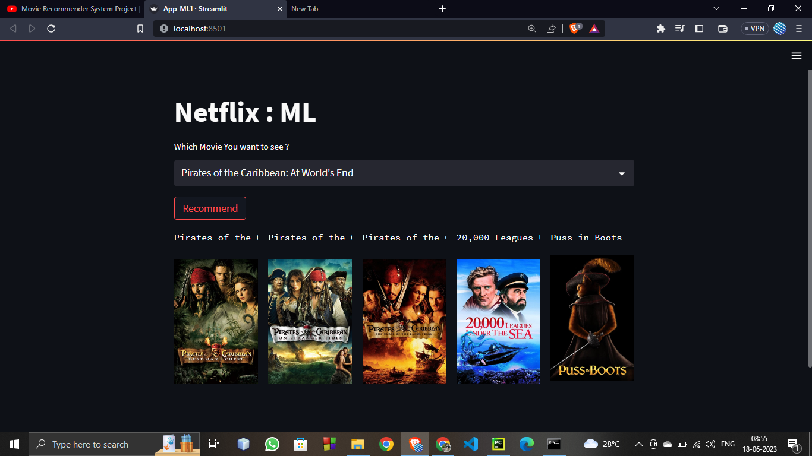

# movie-recommender-system-tmdb-dataset
A content based movie recommender system using cosine similarity

Requirements = install using =>  pip install 'numpy,pandas,sklearn,streamlit'

Run File = "streamlit run App_ML1.py"

